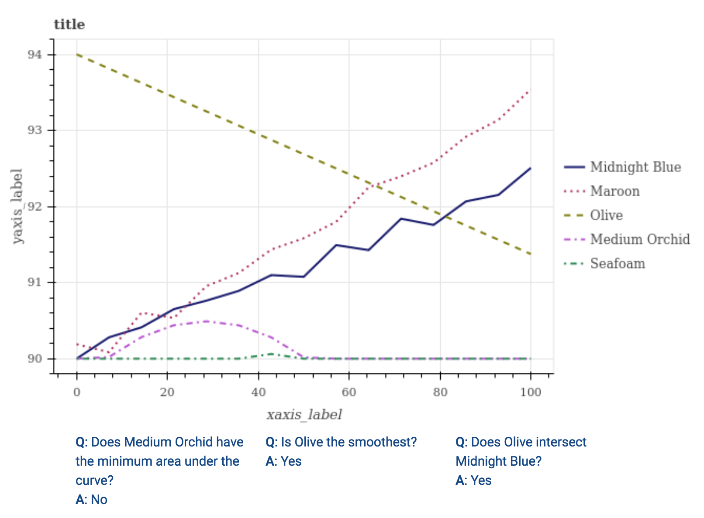
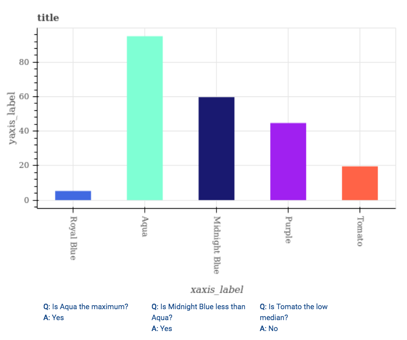
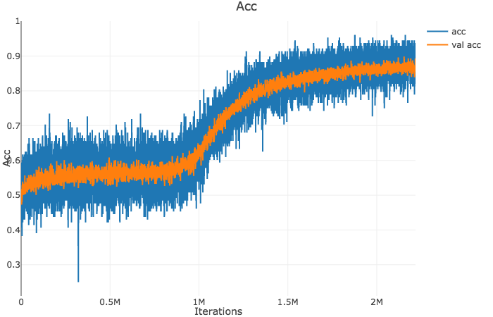
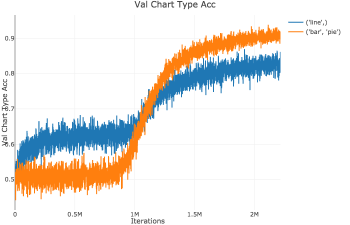

__tl;dr:__ replication of FigureQA baselines ([results](#results), [running the code](#running-the-code))

Relation Networks for FigureQA
===

Computer vision has made great progress in understanding natural images,
but less attention has been paid to non-natural images.
The FigureQA dataset ([website][figqa_site], [paper][figqa_paper])
considers a visual question answering task where questions are posed
about plots of synthetically generated data.

<div style="float:left">


</div>

All answers are yes/no and the synthetic nature of the dataset allows it
to avoid bias toward yes or no based on only questions or only images.
Ideally, this lack of bias combined with the analytical nature of the
task will make good performance on this dataset more indicative of reasoning
capability and less indicative of an ability to fit complex perceptual biases.

The FigureQA paper implements some baselines, including a Relation Network
because it performs well on similar reasoning-inspired tasks.
This repository presents a replicability study which re-implements these
baselines and evaluates them on the FigureQA dataset.

Models
---
These models predict an answer (yes or no) given an image and a question.

1. __LSTM__ (question only)  
This model embeds the question and feeds the embedding to some fully connected
layers to do answer classification. The image is ignored, so the only signal
available is question-answer bias.

2. __CNN + LSTM__ (images and questions)  
Embed the question using the same LSTM as before. Also embed the image using
a straightforward CNN, then concatenate the two representations and feed
that embedding into an answer classifier (fully connected layers).

3. __RN ([Relation Network][relnet_paper])__ (images, questions, and object relations)  
Extract image and question embeddings using the same LSTM and CNN as
before. Treat each pixel in the resulting feature map as an object
and embed pairs of objects concatenated with question features.
Classify the average (over object pairs) of these embeddings
to predict an answer.

Results
---

| Model                                                                                     | train1 accuracy | validation1 accuracy | validation2 accuracy | validation2 accuracy (from the paper) | test2 accuracy (from the paper) |
|----------                                                                                 |-----------------|----------------------|---------------       |-----------                            |-------------------              |
| [LSTM](https://www.cc.gatech.edu/~mcogswell6/figqa-pytorch/models/repl-lstm1_ep143.pt)         | 54.19%          | 53.26%               | 52.18%               | 50.01%                                | 50.01%                          |
| [CNN+LSTM](https://www.cc.gatech.edu/~mcogswell6/figqa-pytorch/models/repl-cnn-lstm1_ep119.pt) | 75.62%          | 71.48%               | 63.80%               | 56.16%                                | 56.00%                             |
| [RN](https://www.cc.gatech.edu/~mcogswell6/figqa-pytorch/models/repl-rn1_ep420.pt)             | 93.12%          | 90.71%               | 86.14%               | 72.54%                                | 72.40%                             |
| Human                                                                                     |                 |                      |                      | 91.21%                             |

Observations:

* The LSTM achieves slightly better than the 50% performance it is supposed to
achieve on validation/test data, so there might be some bias in the validation
set. If so, the bias is small and not very sigificant.

* All models implemented here achieve much higher validation2 accuracies than
the corresponding models reported in the paper. Why is this? I don't know, but
two possible explanations relate to slow training dynamics and minor differences
in hyperparameters.
    * The RN runs into an obstacle during training. From about iteration 100K to
      iteration 900K the model seems to have converged. However, there's a
      20%-30% gain in validation accuracy that begins at about iteration 1M
      (left plot). The model initially can not answer any questions about
      bar/pie charts, but it suddenly starts to do well on these kinds of plots
      at that transition point.
      <div style="float:left">
      
      
      </div>
    * Some hyperparameters are slightly different than the ones
      specified in the paper, though I have tried to be fairly accurate
      in my replication of hyperparameters. (One exception is the
      learning rate decay, which is 1.0 instead of 0.9.)


[figqa_site]: https://datasets.maluuba.com/FigureQA
[figqa_paper]: https://openreview.net/references/pdf?id=r1SN9M-R-
[relnet_paper]: https://arxiv.org/abs/1706.01427


Running the code
===

(Note: implemented with PyTorch version 0.4.0a0+05ebd21)

1. Download the [FigureQA dataset][figqa_dl] and untar the archives
   into `data/figureqa`. That directory should contain directories named
  `sample_train1`, `train1`, `validation1`, `validation2`,
  `no_annot_test1`, and `no_annot_test2`.
2. Preprocess the data

    ```
    # Pre-processing section of run.py
    $ ./run.py
    ```

3. You can skip this step by downloading models from the links in the
   results table above.
   To train a model comment out the Pre-processing section
   of `run.py` and uncomment the Train section. This command
   will train any of the 3 models implemented here (set `--model`
   to `lstm`, `cnn+lstm`, or `rn`). It logs some basic information
   to the command line and more detailed information to a
   [visdom][] environment. To setup the visdom environment:

    ```
    $ pip install visdom
    # on any machine
    $ python -m visdom.server -port 8894
    # edit this file appropriately
    $ cp .visdom_config.json.example .visdom_config.json
    ```

   Now actually begin training, running the script once for each choice
   of `--model`. Note that as many gpus as are available according
   to `$CUDA_VISIBLE_DEVICES` will be used.

    ```
    $ ./run.py
    ```

   This could take a week (RN), a day or two (CNN+LSTM), or an hour or
   two (LSTM). The training process will checkpoint the model and optimizer
   once every epoch, saving the results into
   `data/checkpoints/<start_time>/model_ep<epoch>.pt` by default.

4. To evaluate the model uncomment the appropriate secion of `run.py`
   and set the `checkpoint` variable so it points to a trained model
   (`.pt` file). After running

    ```
    $ ./run.py
    ```
   a file will have been saved to
   `data/results/result_<split>_<result-name>.pkl` containing accuracies
   and various other meta-data for the model. Running

    ```
    $ ./scripts/read_results.py data/results/result_*_<result-name>.pkl
    ```

   will report basic results from these files.


[figqa_dl]: https://datasets.maluuba.com/FigureQA/dl
[visdom]: https://github.com/facebookresearch/visdom
